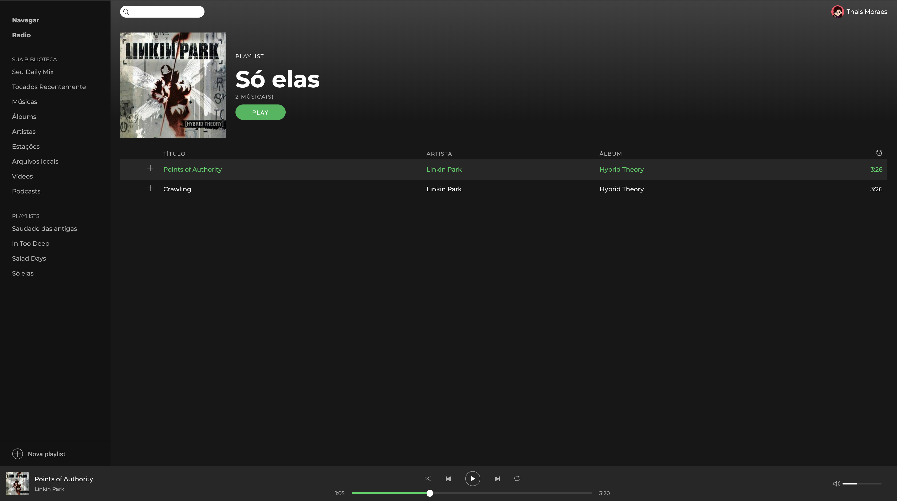
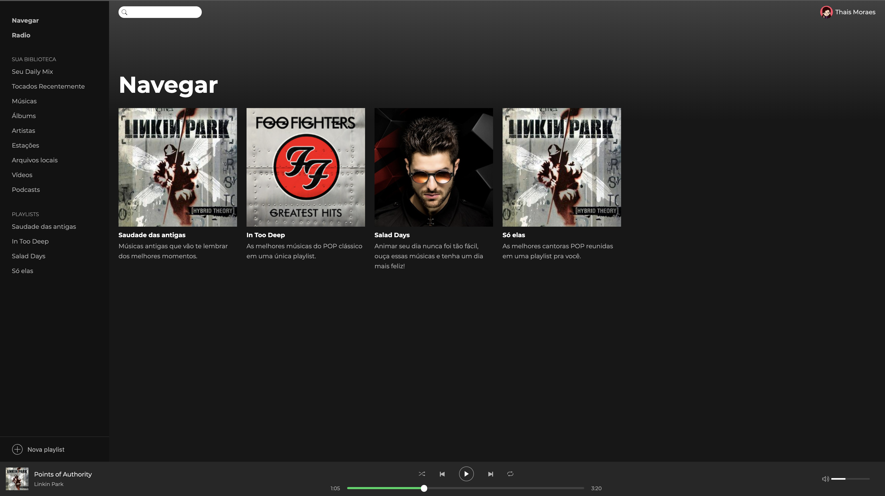

# Spotify Clone

App to reproduce the main appearence and functionality of Spotify.

 

## Main technologies/libs/components used

- React JS
- Redux (with Duck Pattern)
- Redux Saga
- Styled Components
- JSON-server (mockup API)
- rc-slider (Slider UI component for React)
- react-sound (Sound component to play audio in the app)

## Main features

- List playlists
- Play/pause song
- Play next/previous song
- Control song execution time with the player slider
- Change volume
